<div align="center">

# Isaac Weather FX

**A physical sky and real weather for [NVIDIA Isaac Sim](https://developer.nvidia.com/isaac-sim) — from a panel, from Python, or from a single integer.**

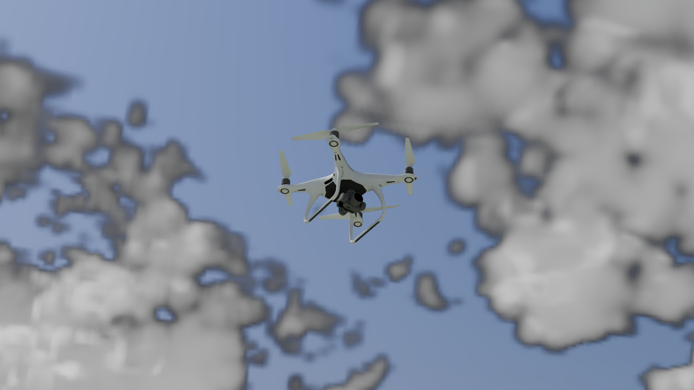

*Nothing in that stage emits light. The sun, the moon and the sky are this extension's.*

</div>

---

Point it at a **place**, a **date** and an **hour**, and it puts the real sun and the real moon
where the ephemeris says they are, bakes a physical sky around them, and hangs a three-dimensional
cloud field in it. Then add the weather you actually wanted: fog by visibility in metres, rain by
millimetres an hour, snow, wind with gusts.

Everything an RTX camera renders is affected — the viewport, Replicator render products, ROS
camera publishers. Everything the panel does, a script can do, and the two stay in sync.

```python
from weather_fx import api as weather
wx = weather.get_controller()

wx.set_site(48.14, 11.58)                     # Munich
wx.set_time(date_utc="2024-06-21", hour_utc=18.7)
wx.set_clouds(enabled=True, cover=0.26, genus="cumulus")
```

…or let it draw the whole thing:

```python
wx.randomize(11)        # 'broken cumulus, larger and deeper'
```

---

## Gallery

Every frame below came out of one script,
[`examples/capture_gallery.py`](examples/capture_gallery.py), on one stage, with two cameras and
**no lights**. The clocks are solved from the ephemeris rather than typed: "golden hour" is the
hour at which the sun is genuinely four degrees up at that place on that date.

<table>
<tr>
<td width="50%"></td>
<td width="50%">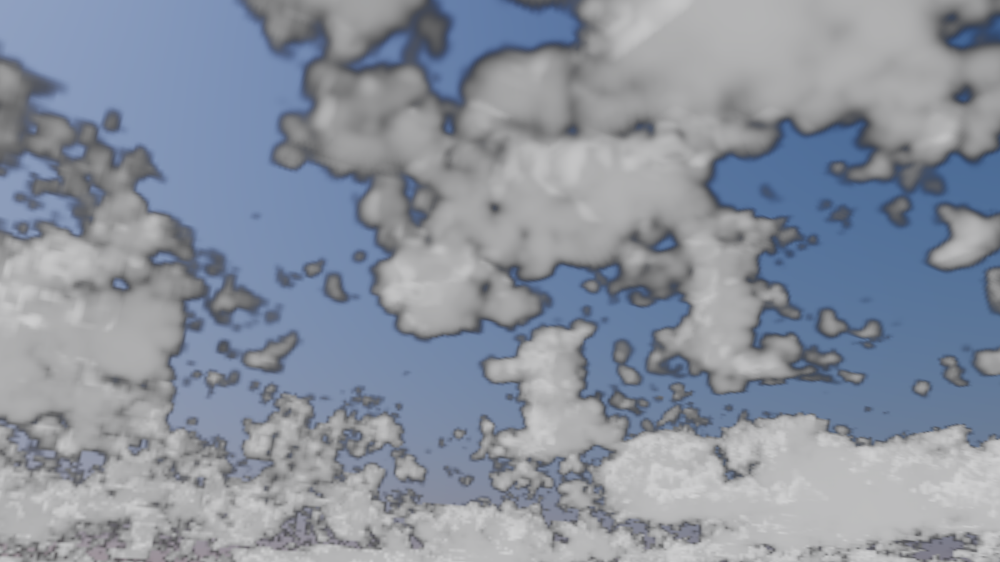</td>
</tr>
<tr>
<td><b>Clear, high summer sun.</b> The Rayleigh gradient from a deep zenith to a pale horizon, from the Preetham distribution rather than a painted ramp.</td>
<td><b>Fair-weather cumulus.</b> Bases on one level, at the condensation height the temperature and dew point imply — 125 m per kelvin of spread.</td>
</tr>
<tr>
<td>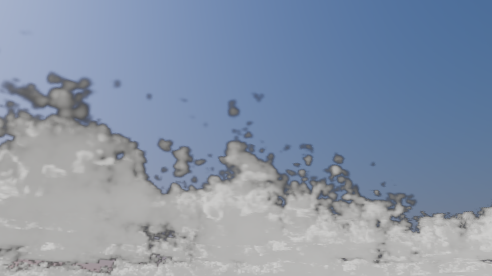</td>
<td>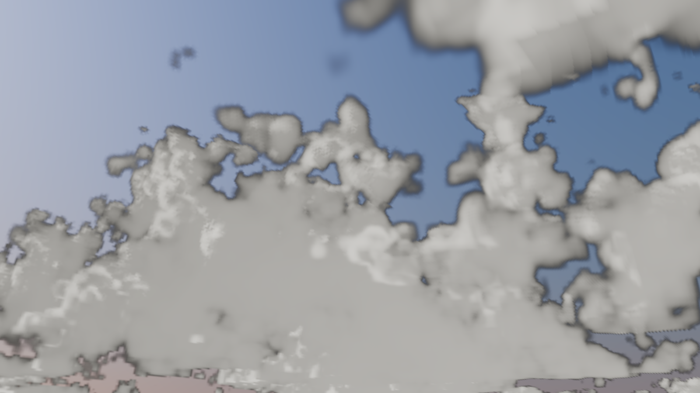</td>
</tr>
<tr>
<td><b>Broken cumulus.</b> A genuine <code>density(x, y, z)</code>, so the lit sides are bright, the bases grey and the gaps real gaps.</td>
<td><b>Congestus.</b> The same field given height: the towers shade their own bases, which a map of column depth cannot do.</td>
</tr>
<tr>
<td></td>
<td>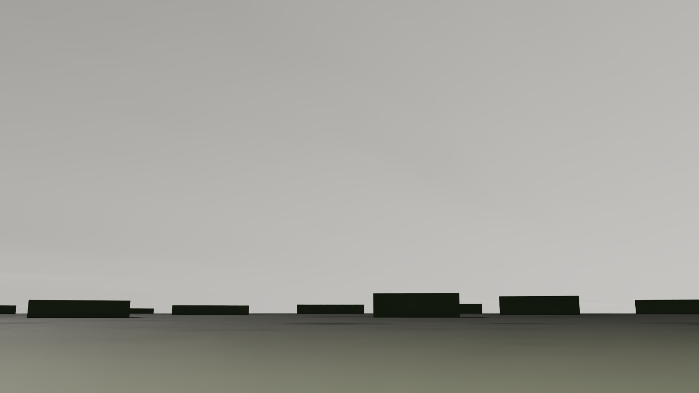</td>
</tr>
<tr>
<td><b>Cirrus.</b> Thin, high and barely attenuating — a whitened sky, not a grey one.</td>
<td><b>Overcast stratocumulus.</b> Shadowless, and about a quarter of the clear-sky light: Kasten–Czeplak, not <code>1 − cover</code>.</td>
</tr>
<tr>
<td>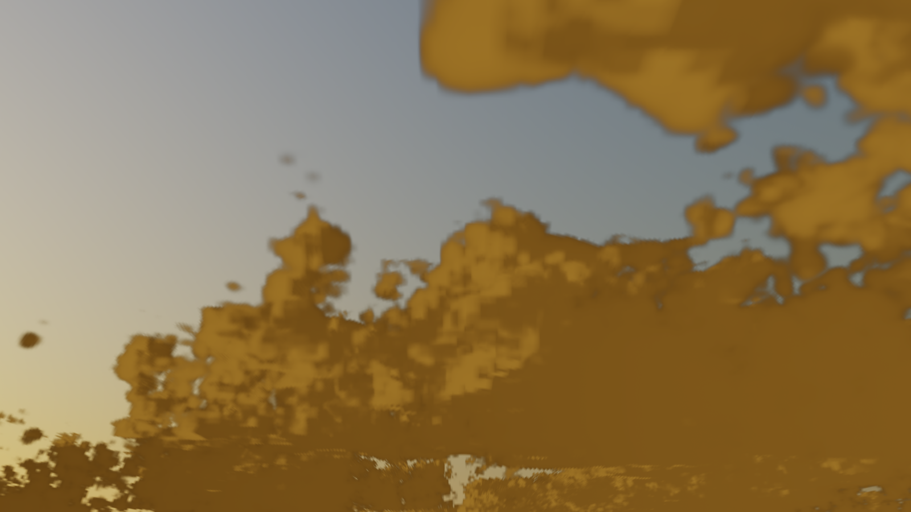</td>
<td>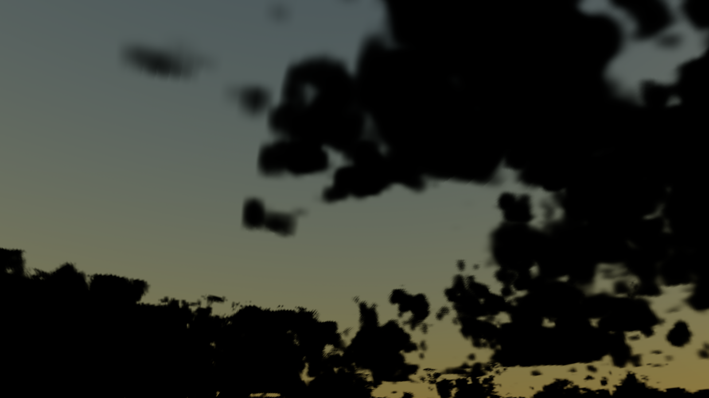</td>
</tr>
<tr>
<td><b>Golden hour.</b> Twelve airmasses take essentially all of the blue out of the beam and little of the red. The cloud is white; the light is not.</td>
<td><b>Blue hour.</b> Civil twilight, the sun four degrees down. Daylight fading out, stars not yet in — one continuous function, so a time-lapse does not pop.</td>
</tr>
<tr>
<td>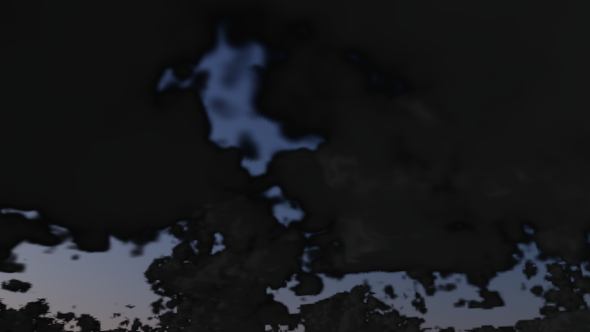</td>
<td>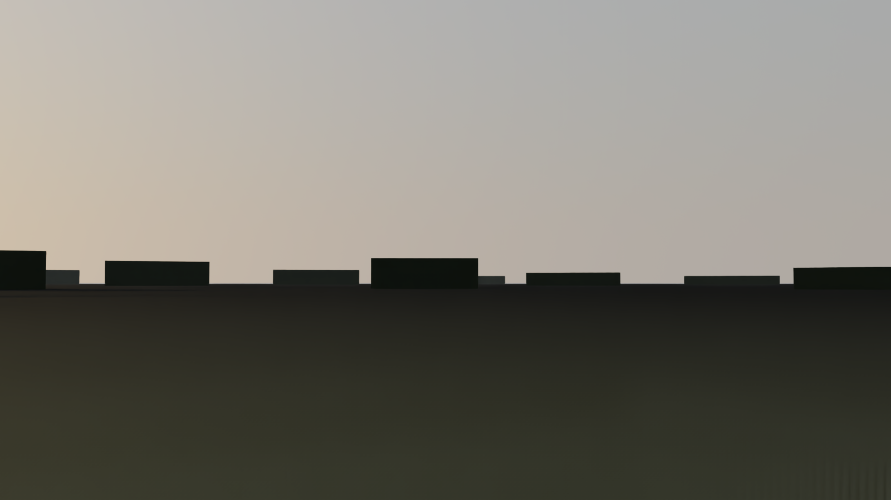</td>
</tr>
<tr>
<td><b>A real full-moon night</b>, found by searching the ephemeris. The same Perez distribution as the day, with a source four hundred thousand times fainter.</td>
<td><b>Radiation fog, 180 m visibility.</b> A saturated surface layer — so, correctly, no convective cloud above it.</td>
</tr>
<tr>
<td>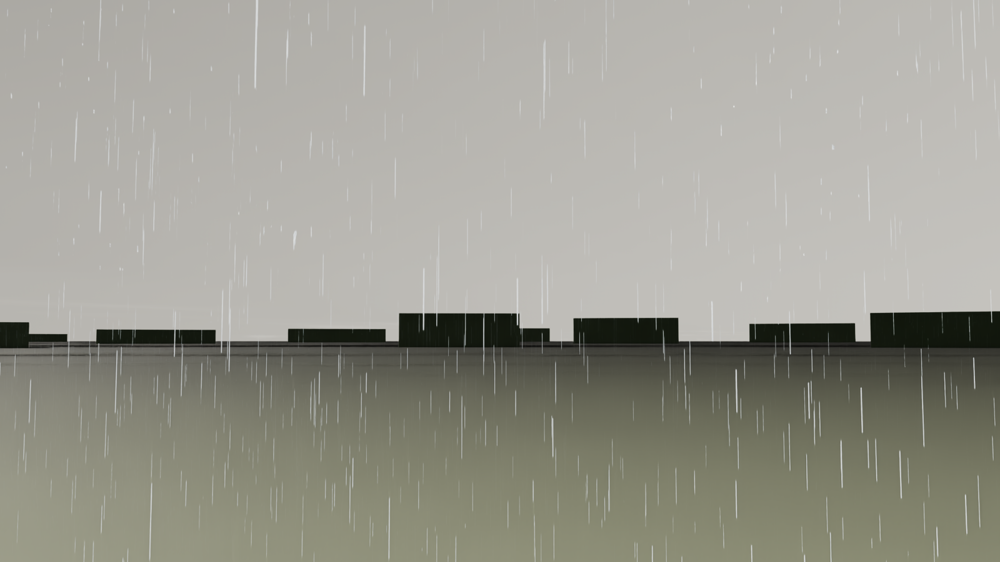</td>
<td>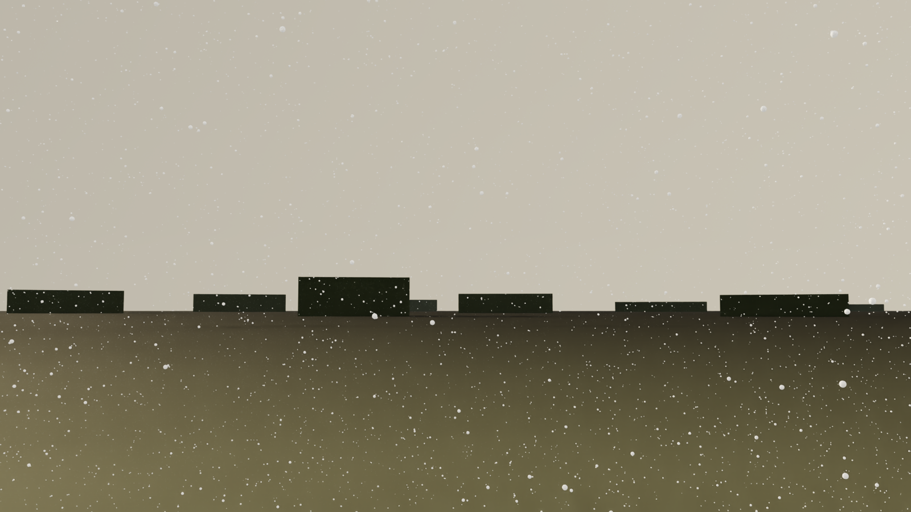</td>
</tr>
<tr>
<td><b>22 mm/h.</b> Marshall–Palmer drop sizes, terminal velocity per drop, streak length = speed × exposure.</td>
<td><b>Blizzard.</b> Sub-zero air, 260 m visibility, flakes swaying as they fall. The cap on particle count, not the density, is what a blizzard runs into.</td>
</tr>
<tr>
<td>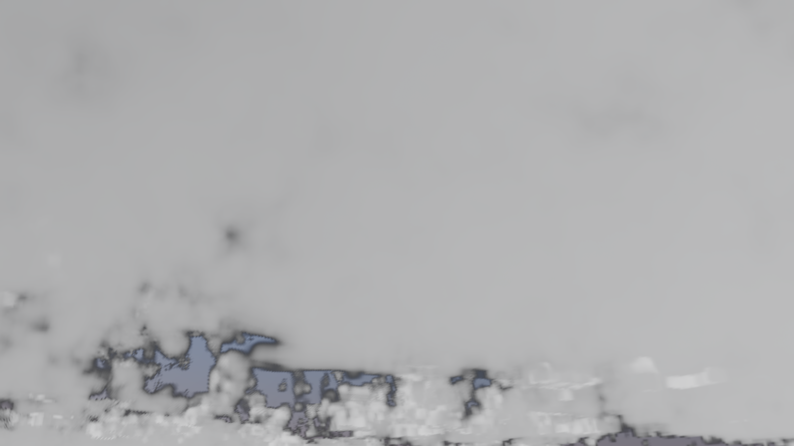</td>
<td>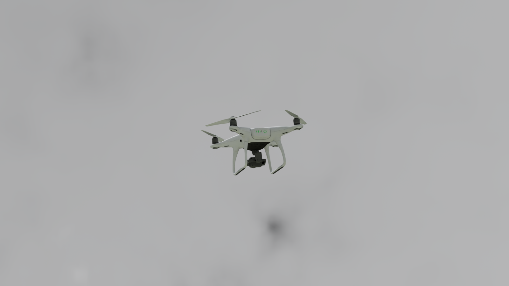</td>
</tr>
<tr>
<td colspan="2" align="center"><b><code>wx.randomize(11)</code></b> — one integer, and every parameter drawn <i>with its couplings</i>: rain scavenges aerosol, so the air between the drops is clearer than a hazy dry day.</td>
</tr>
</table>

### The same sky, one subject in it

<table>
<tr>
<td width="33%">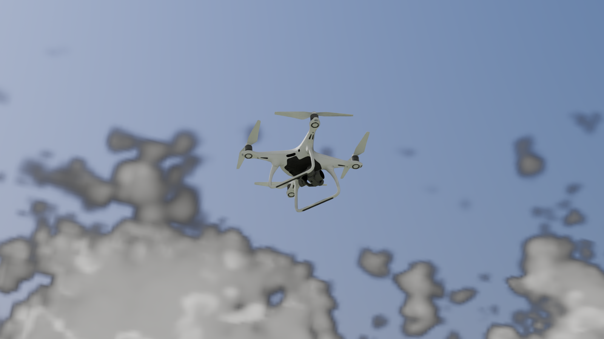</td>
<td width="33%"></td>
<td width="33%">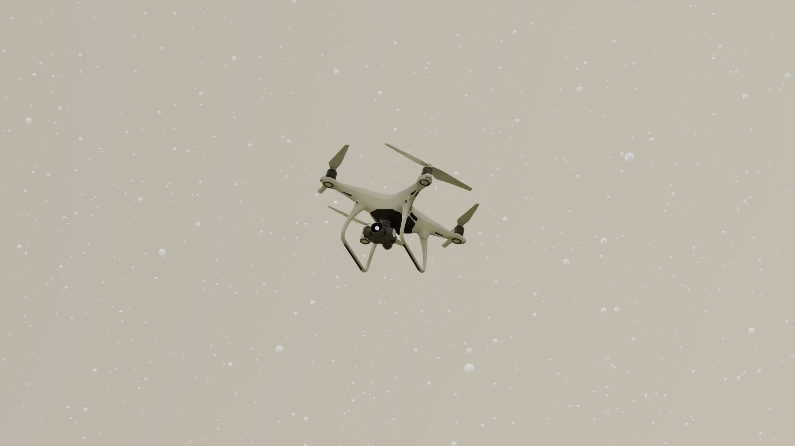</td>
</tr>
<tr>
<td align="center">Broken cumulus</td>
<td align="center">Golden hour</td>
<td align="center">Blizzard</td>
</tr>
</table>

*(The aircraft is any USD you point `--asset` at; nothing about it is built in.)*

---

## Install

1. Clone this repository.
2. In Isaac Sim: **Window → Extensions → ☰ → Settings → Extension Search Paths**, add `<repo>/exts`.
3. Search for **Weather FX**, enable it, and open **Window → Weather FX**.

Isaac Sim 5.x / 6.0 (Kit 107+). No dependency but numpy.

---

## What is in it

| | How it works | Main controls |
|---|---|---|
| **Sky** | Sun and moon from the real ephemeris; a Preetham–Shirley–Smits daylight sky, a moonlit night built from the same distribution, and a starlight floor beneath it — baked to an HDR dome | latitude, longitude, date, hour, turbidity, ground albedo, exposure |
| **Cloud** | A genuine three-dimensional density field with per-height morphology, shaded by multi-octave multiple scattering inside a two-stream albedo envelope | cover, genus, base height, thickness, optical depth, feature size |
| **Fog** | RTX Simple Fog, driven by **visibility in metres** (Koschmieder, 5 % contrast) | visibility, colour, start/end distance, height fog |
| **Rain** | A camera-following `PointInstancer`; Marshall–Palmer drop sizes, terminal velocity per drop, streak length = speed × exposure | rate (mm/h), density scale, exposure, drop size range |
| **Snow** | The same volume system with fall-speed jitter and sway; its water-equivalent rate is *derived* from the flake population | flake density, size, fall speed, sway |
| **Wind** | Speed and direction with smooth gusts, applied to rain and snow | speed, direction, gusts |
| **Lighting** | Scales scene light intensities for overcast looks | light scale, include dome lights |

Also:

- **Ten presets** (`clear` … `blizzard`), JSON save and load, and your own via `register_preset`.
- **A coherent randomiser** — regime first, then parameters, with the couplings that make a day
  hang together. Fog needs a tiny dew-point spread and no wind; snow needs sub-zero air. Drawing
  each parameter independently produces days that cannot happen, and a model trained on those
  learns the noise.
- **Weather as data**: `wx.surface_weather()` returns air temperature, humidity, wind, cloud,
  irradiance, visibility and precipitation on a regular grid, in SI, so a thermal or sensor model
  integrates the same weather the camera is looking at.
- **A manual time source** (`seed` + `step(dt)`) for deterministic synthetic data.
- **Non-destructive edits.** Prims and light changes live in the **session layer** and render
  settings are restored when an effect is turned off. Your USD files are never modified.

---

## A few things that are easy to get wrong, and are not

- **Cloud is a volume, not a heightfield.** A horizontal map of column depth extruded upward gives
  every cross-section the same shape, and reads as a row of smooth mounds. Two levels a third of
  the depth apart here share an intersection-over-union of about **0.24**, where an extrusion
  scores 1.0 by construction.
- **A forward march cannot brighten a cloud with depth.** Its value is bounded by the mean
  scattered term, so optical depth 60 comes out no brighter than 20 — and a sunlit cumulus renders
  *darker than the sky behind it*. The energy here comes from the two-stream reflectance of a
  conservatively scattering layer; the march supplies the directional detail around it.
- **Turbidity has to redden the beam and brighten the sky**, not dim both. Haze that dims
  everything is describing a smaller sun.
- **The beam is white-balanced for daylight**, because every photograph of a white cloud was. Skip
  that step and midday clouds come out correctly lit and visibly khaki.
- **Meter the sky on its highlights.** A median drags the exposure up at sunset until the solar
  half clips, and at civil twilight the median of the upper hemisphere is zero to float precision.
- **Overcast keeps a quarter of the global irradiance**, not `1 − cover`. The cloud that blocked
  the beam is itself a bright scatterer, and broken cloud puts the *diffuse* above its clear-sky
  value.

The physics layer is `weather_fx/core/` — plain Python and numpy, no Omniverse imports, **166
tests that run in five seconds without a renderer**.

---

## Documentation

| | |
|---|---|
| [**Guide**](docs/GUIDE.md) | Install, the Python API, weather as data, deterministic generation, first-run calibration |
| [**Architecture**](docs/ARCHITECTURE.md) | The layout, the core/Kit boundary, how to add a parameter, an effect or a sensor |
| [**Limitations**](docs/LIMITATIONS.md) | What this does not do, and which numbers are estimated rather than measured |
| [**Roadmap**](ROADMAP.md) | What is planned |

```bash
pip install -e ".[dev]"
pytest                                            # no Isaac Sim needed
./python.sh examples/standalone_weather_demo.py   # the extension, driven from a script
./python.sh examples/capture_gallery.py --asset /path/to/your.usdc   # the gallery above
```

---

## License

MIT. See [LICENSE](LICENSE).

Optional hero clouds use the **Walt Disney Animation Studios Cloud Data Set**, Copyright 2017
Disney Enterprises, Inc., licensed under
[CC BY-SA 3.0](https://creativecommons.org/licenses/by-sa/3.0/). It is not included in this
repository; `tools/fetch_hero_cloud.py` downloads it from
[Disney Animation](https://www.disneyanimation.com/resources/clouds/). Credit it wherever it, or an
image rendered with it, is shown.
